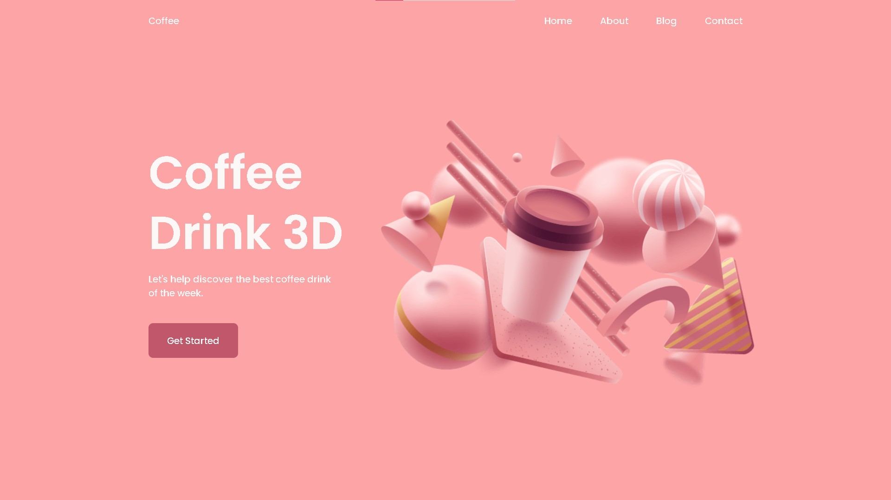
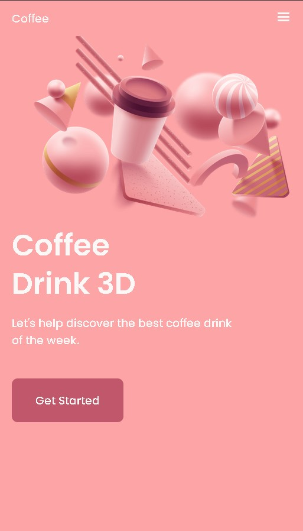
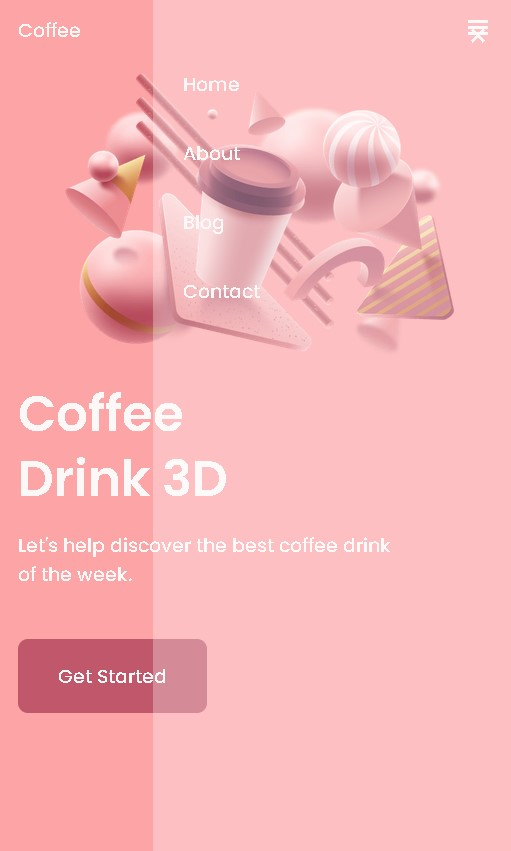

    <h1>🍑Responsive Landing Page</h1>
    
O objetivo desse projeto foi desenvolver uma landing page responsiva utilizando animações do JavaScript, assim como práticar SCSS, conhecimentos que quero me aprofundar.

    <h2>💻Linguagens usadas<h2>
    
    
    
    

    <h2>💡Meu aprendizado</h2>
    
Desenvolvendo esse projeto aprendi novas funcionalidades do JavaScript, com a animação das imagens. utilizando o GSAP. Assim como o desenvolvimento com pré-processadores de CSS, que consegui tirar da teoria e exercitar meus conhecimentos.

    <h2>☕Resultado</h2>
    
    
    

